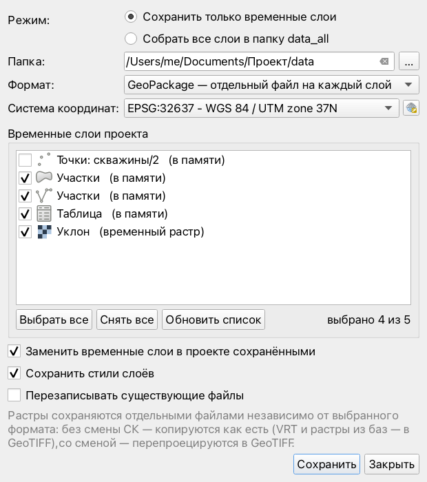
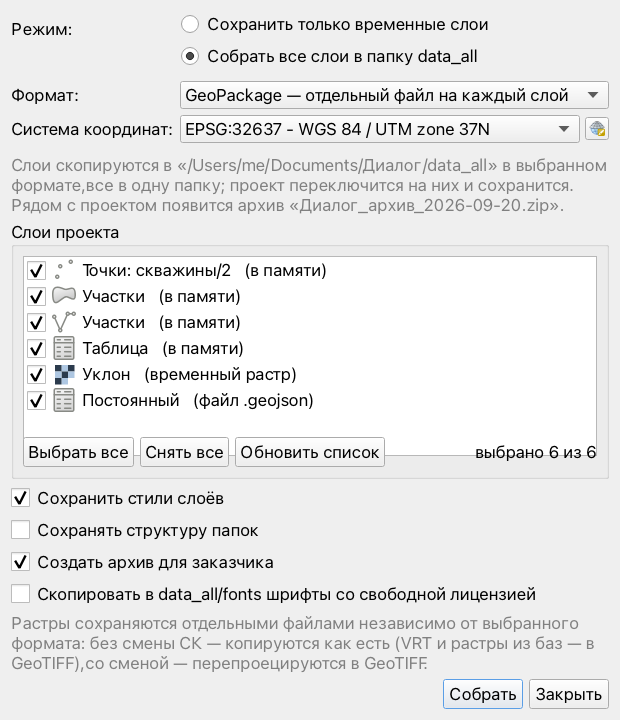
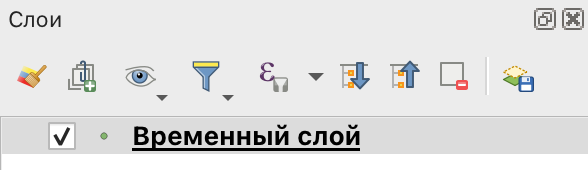

# Сохранение временных слоёв — плагин QGIS

Плагин находит в проекте QGIS все временные слои и одним нажатием сохраняет их в выбранную папку. Временные слои — это слои в памяти (scratch layers) и результаты «Обработки», записанные во временную папку. По желанию плагин сразу переключает слои проекта на сохранённые файлы, и они перестают быть временными.

Второй режим — **собрать проект**: все слои проекта копируются в папку `data_all` рядом с проектом (по желанию — по тем же подпапкам, что и в папке проекта), проект переключается на них, а по желанию рядом появляется архив для заказчика со свободными шрифтами.



## Возможности

- **Два режима:**
  - *сохранить только временные слои* — векторные слои в памяти и результаты «Обработки» из временной папки (вектор и растр) в выбранную папку;
  - *собрать все слои в папку data_all* — ещё и постоянные: файлы, базы (PostGIS, SpatiaLite), WFS, CSV, растры; по флажку «Сохранять структуру папок» — по исходным подпапкам, по флажку «Создать архив для заказчика» — ещё и zip (см. ниже). Онлайн-подложки (WMS, XYZ) и векторные тайлы сохранить нельзя — они видны в списке серыми с пояснением. Облака точек и сетки (mesh) собираются только с форматом «оставить родные форматы файлов»: их файлы копируются как есть. Так же помечается слой, файл которого удалили с диска при открытом проекте: QGIS ещё показывает его на карте, но собрать его уже нельзя.

  Слои показываются списком с галочками в порядке панели «Слои».
- **Исходные данные не меняются.** Несохранённые правки постоянного слоя в режиме редактирования попадают только в копию. Файл, из которого читает слой проекта, не будет перезаписан, даже если сохранять в ту же папку с включённой перезаписью: копия получит другое имя.
- **Форматы:**
  - GeoPackage, отдельный файл на каждый слой (по умолчанию);
  - GeoPackage, все слои в одном файле;
  - ESRI Shapefile;
  - GeoJSON;
  - **оставить родные форматы файлов** — слои не переводятся в другой формат, а их файлы копируются как есть, со всеми сопутствующими файлами и стилями. Файл с несколькими слоями (GeoPackage, KML) копируется один раз. Так собираются облака точек и сетки. Слои без файла (в памяти, из баз, WFS) и слои со сменой системы координат сохраняются в GeoPackage.
- **Растры** копируются как есть вместе с `.aux.xml`, `.ovr` и прочими сопутствующими файлами. VRT, растры внутри GeoPackage и подобные источники переводятся в GeoTIFF. При смене системы координат растры перепроецируются в GeoTIFF.
- **Система координат.** Можно оставить СК каждого слоя или перепроецировать все слои в одну. Подойдёт любая СК: EPSG, СК проекта или пользовательская, например МСК.
- **Замена в проекте.** Слои переключаются на сохранённые файлы, а стиль, подписи, порядок в дереве, связи и объединения остаются прежними. Для временных слоёв это флажок (по умолчанию включён), при сборке в data_all слои переключаются всегда.
- **Стили** сохраняются внутрь GeoPackage (один файл на слой) или в `.qml` рядом с Shapefile, GeoJSON и растрами и применяются сами при открытии файла.
- **Имена.** Файл называется по названию слоя: «Опоры» → `Опоры.gpkg`. В режиме «все слои в одном файле» так называются слои внутри GeoPackage, а имя самого файла задаётся в окне. Одинаковые имена не затирают друг друга: к ним добавляются `_2`, `_3`, если не включена перезапись. Недопустимые в именах файлов символы (`: / ? *` и т.п.) заменяются на `_`. Слой внутри GeoPackage не может называться с `-`, скобки или точки — у слоя «- поворотные точки» файл `- поворотные точки.gpkg`, а слой в нём — «поворотные точки».
- **Мелочи:**
  - несохранённые правки слоя в режиме редактирования применяются перед записью;
  - поле `fid` с повторяющимися значениями не ломает запись в GeoPackage;
  - слой без геометрии сохраняется в Shapefile как `.dbf`.
- Последние настройки запоминаются.

## Сборка проекта в data_all и архив для заказчика

Режим «Собрать все слои в папку data_all» по одной кнопке собирает проект в одну папку, а если рядом отмечен флажок «Создать архив» (по умолчанию отмечен), ещё и делает архив.

**1. Собирает проект в одну папку.** Отмеченные слои, растры, свои картинки (SVG-значки, логотипы в макетах) и шрифты со свободной лицензией копируются в папку `data_all` рядом с файлом проекта, слои проекта переключаются на эти копии, пути делаются относительными, и проект сохраняется. После этого исходные файлы можно удалить — проект продолжит работать.

```
ЛЭП Михайловская.qgz
data_all/
  Опоры.gpkg, Трасса.gpkg, …        слои (формат — как выбран в окне)
  images/логотип.svg                свои картинки (со «структурой папок» — в symbols/)
  fonts/                            шрифты со свободной лицензией
ЛЭП Михайловская_архив_2026-09-18.zip
```

**Сохранять структуру папок** (флажок, по умолчанию выключен; работает с любым форматом). Слои раскладываются по тем же подпапкам, что и исходные файлы (`PROJECT_DIR` — папка файла проекта). Без флажка всё ложится прямо в `data_all`. Флажок и «Формат» независимы: можно скопировать файлы как есть в одну папку, а можно перевести все слои в GeoPackage, сохранив подпапки.

| Где лежит источник | Куда копируется |
|---|---|
| `PROJECT_DIR/data/…` | `data_all/<тот же путь внутри data>` |
| прямо в `PROJECT_DIR` | `data_all/<имя файла>` |
| в другой папке проекта | `data_all/<путь от PROJECT_DIR>` |
| вне `PROJECT_DIR` | `data_all/external_links/<обрезанный путь>/<имя файла>` |

Растры, облака точек и сетки раскладываются по тем же правилам, но каждый тип — в свою папку: `data_all/raster/…`, `data_all/pointcloud/…`, `data_all/mesh/…`.

```
Проект ЛЭП/                              Проект ЛЭП/data_all/
  data/ЛЕС/лес.shp (.shx .dbf .prj…)  →    ЛЕС/лес.shp (.shx .dbf .prj…)
  граница.geojson                     →    граница.geojson
  Рабочие файлы/точки.csv             →    Рабочие файлы/точки.csv
  data/Рельеф/dem.tif (.tfw .ovr…)    →    raster/Рельеф/dem.tif (.tfw .ovr…)
  орто.tif                            →    raster/орто.tif
  data/Лидар/облако.laz               →    pointcloud/Лидар/облако.laz
  data/база.gpkg (вектор и растр)     →    база.gpkg
~/Desktop/ЛЭП/узел7/trees.shp         →    external_links/Desktop/ЛЭП/узел7/trees.shp
D:\GIS\dem.tif                        →    raster/external_links/D/GIS/dem.tif
\\server\share\a\b.shp                  →    external_links/_server_share/a/b.shp
```

- **Внешние пути обрезаются.** Путь считается от домашней папки, а если файл вне её — от корня диска, сетевой папки или тома (на macOS `/Volumes/YD/…` → `YD/…`). Системные папки (Windows, Program Files, AppData, `/usr`, `/etc`, Library…) выбрасываются, остаются последние 3 папки. Совпавшие после обрезки имена получают `_2`, `_3` — это видно в журнале окна.
- **Со всеми сопутствующими файлами:** Shapefile (`.shp .shx .dbf .prj .cpg .qpj .sbn .sbx .shp.xml`…), растры (`.tfw .jgw .aux.xml .ovr .rrd .vat.dbf`…), MapInfo (`.tab .dat .id .map`), GeoPackage с журналами (`-wal`, `-shm`), стили `.qml`/`.qmd` рядом с файлом.
- **Файл с несколькими слоями** (GeoPackage, SQLite, NetCDF) копируется один раз, и все его слои переключаются на одну копию. Если в нём есть и растр, и вектор (или его читают слои разных типов), он ложится в общую структуру, а не в `raster/`. Папки-источники (`.gdb`, папка шейпов, облако EPT) копируются целиком. Архивы `/vsizip/` копируются как файл.
- **Облака точек** (`.las`, `.laz`, `.copc.laz`, EPT) копируются вместе с индексом, который QGIS строит рядом (`<имя>.copc.laz`). **Сетки** (`.2dm`, `.nc` и др.) — как есть. Эти слои не перепроецируются: при выбранной в окне системе координат они копируются в своей СК, и журнал об этом пишет. Не собираются виртуальное облако точек (`.vpc` — ссылается на другие файлы) и сетка с подключёнными наборами данных: QGIS 3.40 не даёт переключить их на копии. Такие слои видны в списке серыми с пояснением.
- Система координат, назначенная слою в проекте (например, у облака LAS или растра без `.prj`), у копии остаётся та же.
- В адресе слоя меняется только путь: фильтр (`subset`), имя слоя внутри файла, параметры CSV остаются прежними.
- С форматом «оставить родные форматы файлов» переводятся только слои в памяти, из баз данных и WFS (они ложатся в саму `data_all`, временные растры — в `data_all/raster`), а также VRT и слои, которые перепроецируются в другую систему координат. При структуре папок такие слои ложатся на место исходного файла и сохраняют его имя: `мозаика.vrt` → `мозаика.tif`; слой из файла с несколькими слоями (GeoPackage, KML) — под своим названием.
- Разделение по типам отключается константой `SPLIT_BY_TYPE = False` в `copier.py`: тогда растры, облака точек и сетки лежат в общей структуре вместе с векторами.
- Свои значки символов, фона подписей и картинки макетов копируются в `data_all/symbols/`.
- Раскладка повторяет пути, на которые ссылается проект. Если проект уже собирали без подпапок, его слои ссылаются на плоскую `data_all`, и исходные папки неизвестны. Окно предупредит об этом перед сборкой. Для раскладки соберите версию проекта, сохранённую до прошлой сборки.

**2. Собирает архив для заказчика** (флажок «Создать архив») рядом с проектом: `<проект>_архив_<ГГГГ-ММ-ДД>.zip` — проект, `data_all` (вместе с `images/` и `fonts/`) и `Состав.txt` (как открыть, список слоёв, СК, шрифтов).



- Перед сборкой плагин предложит сохранить проект, если есть несохранённые изменения, и спросит подтверждение. Слои с несохранёнными правками нужно сначала сохранить.
- **Система координат** — по желанию: копии слоёв и сам проект переводятся в выбранную СК, а карты в макетах пересчитываются, чтобы не съехали.
- Слои, уже лежащие в `data_all`, повторно не копируются. Слои, с которых снята галочка, остаются где были и в архив не попадают; онлайн-подложки (OSM, спутник) остаются онлайн-слоями.
- **Шрифты** подписей, значков и макетов раскладываются по лицензии, записанной в файле шрифта:
  - *свободные* (SIL Open Font License, Apache, GPL и т.п.) — копируются в `data_all/fonts/` и попадают в архив;
  - *платные* или с запретом на передачу — не копируются, перечисляются в `Состав.txt`;
  - *без указанной лицензии* — тоже не копируются (проверьте и передайте сами, если можно).
- Стандартные значки QGIS (например, стрелки севера) не копируются — они есть в любой установке.
- В архив не попадают служебные файлы GeoPackage (`-wal`, `-shm`): перед упаковкой всё из них переносится в сам `.gpkg`. Если архив с таким именем уже есть, новый получит `_2`.

## Установка

1. Скачайте `temp_layers_to_folder-<версия>.zip` со страницы [Releases](https://github.com/Slider007/qgis-temp-layers-to-folder/releases/latest).
2. В QGIS откройте «Модули → Управление модулями → Установить из ZIP», выберите архив и нажмите «Установить модуль».
3. Во вкладке «Установленные» включите **«Сохранение временных слоёв»**.

Кнопка появится в двух местах:

- на общей панели инструментов модулей компании **«Альтан-Эко»** — её можно открепить и перетащить в любое место окна, QGIS запомнит, где она стоит (включить/скрыть — правой кнопкой по любой панели инструментов);
- на панели «Слои» — последней в строке значков над списком слоёв.

Кроме того, есть пункт в меню «Модули → Альтан-Эко».



> Если у вас установлен плагин «Save Temp Layers» из официального каталога, он не мешает: плагины лежат в разных папках.

## Использование

1. Нажмите кнопку «Сохранить временные слои…».
2. Выберите режим: «Сохранить только временные слои» или «Собрать все слои в папку data_all» (с архивом или без), формат и при необходимости систему координат. Для временных слоёв укажите папку.
3. Отметьте нужные слои и нажмите «Сохранить» или «Собрать».
4. Если временные слои сохранялись с заменой в проекте, **сохраните проект**. При сборке проект сохраняется сам.

Журнал внизу окна показывает, куда записан каждый слой и какие были замечания.

## Совместимость

QGIS 3.40 и новее. Код подготовлен для QGIS 4 (Qt6), но пока проверен только на QGIS 3.40 LTR под macOS.

## Разработка

Структура:

```
temp_layers_to_folder/   код плагина (эта папка и есть плагин)
  saver.py               поиск и сохранение слоёв, без интерфейса
  packager.py            сборка проекта в data_all и архив
  copier.py              сборка со структурой папок: копирование файлов как есть
  fonts.py               поиск файлов шрифтов и их лицензии
  dialog.py              окно плагина
  plugin.py              кнопки на панелях «Альтан-Эко» и «Слои», пункт меню
  altan_toolbar.py       общая панель и подменю модулей компании (одинаковый файл во всех модулях)
  altan_logo.svg         логотип компании для подменю
tests/                   проверки без интерфейса QGIS
build_zip.sh             сборка zip для установки
```

Запуск проверок на Python из установленного QGIS (macOS):

```bash
tests/run_tests.sh
```

Сборка архива для установки (попадёт в `dist/`):

```bash
./build_zip.sh
```

Чтобы правки сразу подхватывались в QGIS, можно вместо копии поставить ссылку на папку плагина:

```bash
ln -s "$PWD/temp_layers_to_folder" ~/Library/Application\ Support/QGIS/QGIS3/profiles/default/python/plugins/
```

## Лицензия

[GNU GPL v2](LICENSE) или более поздняя версия.
